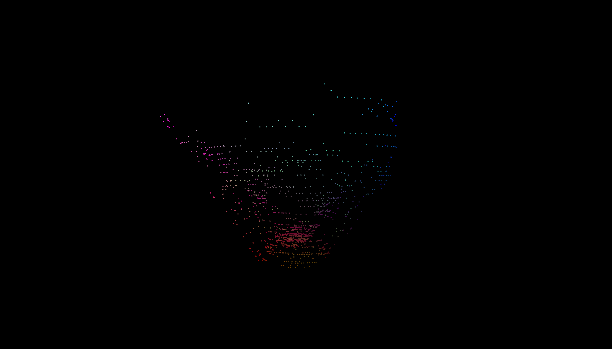
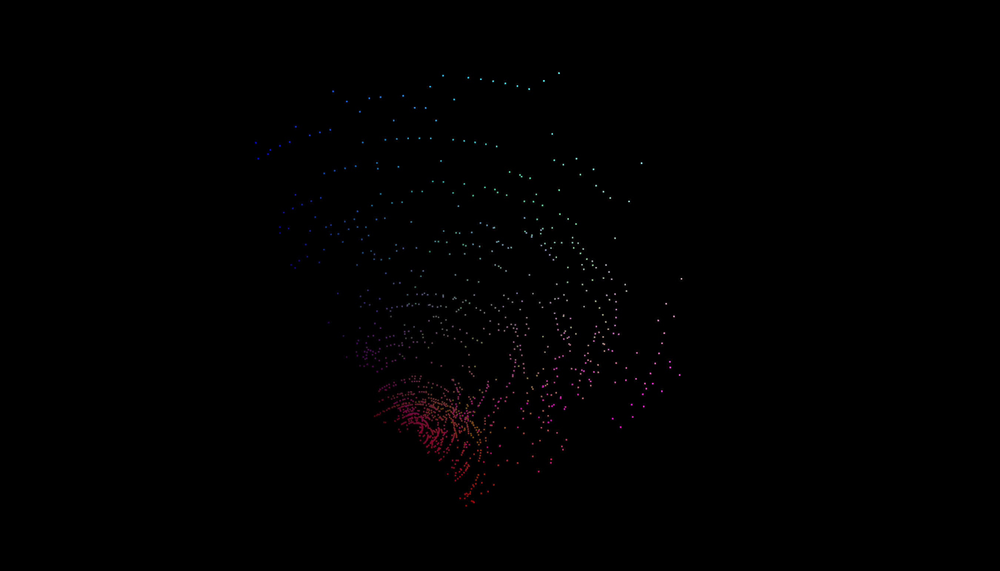
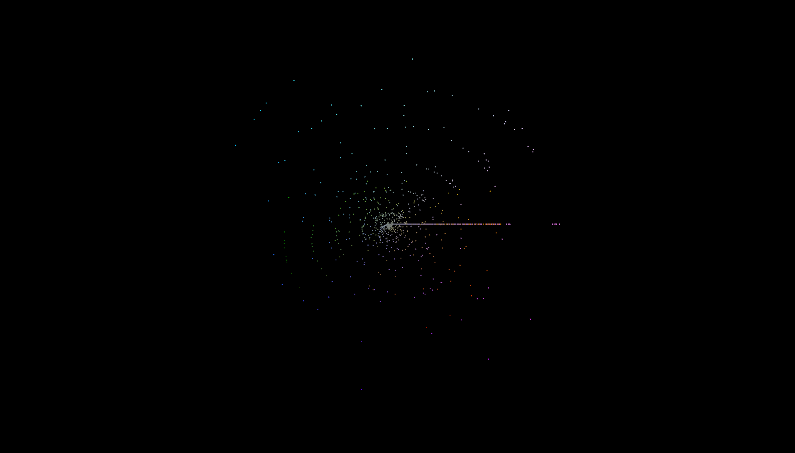
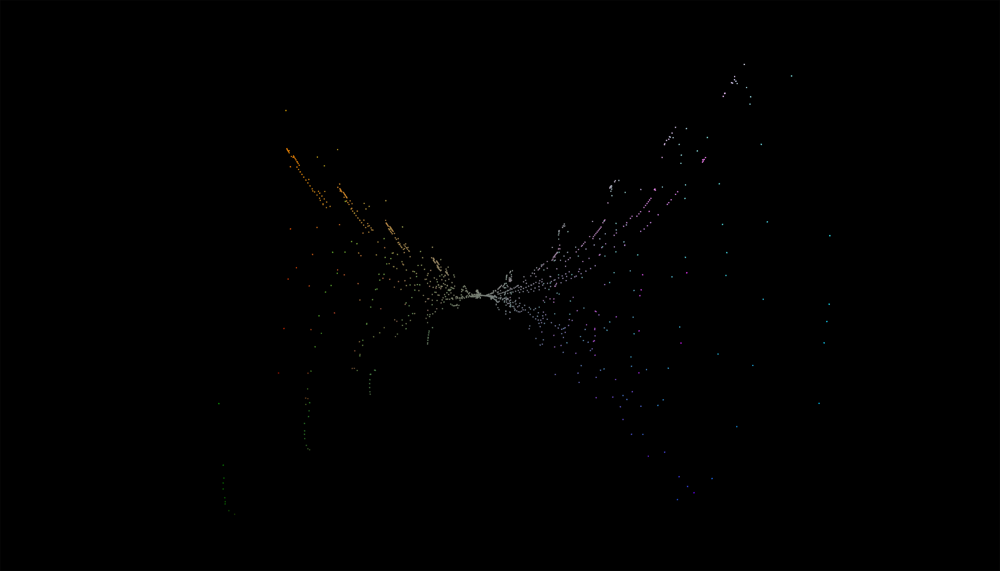
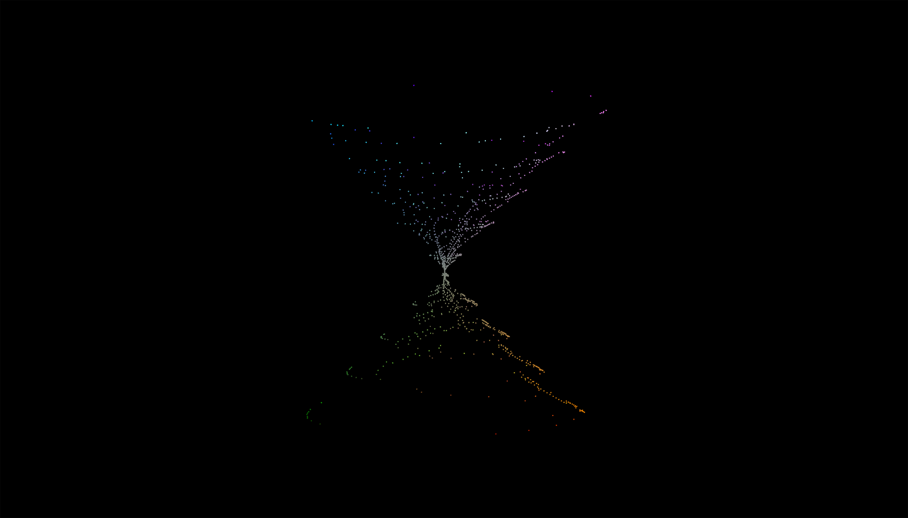

# LIDAR Scanner Control and Data Visualization in Python 

The examples here were created as a class project to enable access to raw data generated by LIDAR modules connected to serial ports via microcontrollers. The program can access any raw data printed to the serial monitor, but is currently designed to parse LIDAR data from the Garmin LIDAR-Lite v4 and Slamtec RPLIDAR A1 devices.

Once data has been collected or imported, the program will render a basic point cloud plot or an interactive plot.

Read more about this project [here.](https://www.jamescole.info/posts/lidar-scanner)

**Tested LIDAR modules**

1. [Garmin LIDAR-Lite v4](https://www.sparkfun.com/products/)
2. [Slamtec RPLIDAR A1](https://www.adafruit.com/product/4010)

## Instructions

### 1. Install packages  
- pySerial: ```pip install pyserial```
- pandas:  ```pip install pandas```
- Matplotlib: ```pip install matplotlib```
- numpy: ```pip install numpy```
- PyVista: ```pip install pyvista```
- PyVistaQt: ```pip install pyvistaqt```

**If using RP Lidar A1**
- rplidar: ```pip install rplidar-roboticia```

### 2. Import packages

### 3. Run scan (a) or import data (b)
#### (a) Run scan 
- Get serial port information 
- Declare ports 
- Scan
- Clean data
- Export data (optional)

#### (b) Import data

### 4. Plot point cloud using PyVista
- Create basic plot
- Create interactive plot 

_Example plots:_  

</img> 
</img>  
</img>  
</img> 
</img>  


## C++ files
**Note:** The C++ files are not required to run this program. They simply demonstrate how information printed to the Serial console from a C++ program can be accessed via Python. 

### Garmin LIDAR-Lite v4 

The files in _cpp/garmin-lidar_ can be used to send lidar distance measurements and servo positions from the Garmin LIDAR-Lite v4 attached to two servos.

**C++ libraries used**  

- [Wire](https://www.arduino.cc/reference/en/language/functions/communication/wire/)
    - Enables I2C communication for the Arduino UNO R4 WifI
- [SparkFun_LIDARLitev4_Arduino_Library](https://github.com/sparkfun/SparkFun_LIDARLitev4_Arduino_Library)
    - _Example1_GetDistance.ino_ in the Examples folder of this library only required slight changes to work for this project.
- [Servo](https://www.arduino.cc/reference/en/libraries/servo/)
    - Control behavior of attached servos. This is a modified version of the Sweep example file from the Servo library.

#### Slamtec RPLIDAR A1

The files in _cpp/rp-lidar_ control a single servo. Data from the RP Lidar A1 can be accessed in Python by installling and importing [RPLidar](https://github.com/Roboticia/RPLidar). 

**C++ libraries used** 

- [Servo](https://www.arduino.cc/reference/en/libraries/servo/)
    - Control behavior of attached servos. This is a modified version of the Sweep example file from the Servo library.
- [Async_Operations](https://www.arduino.cc/reference/en/libraries/async_operations/)
    - Continuously send servo position. Asynchronously send an updated position after a time delay.

## Future work
- Make a generalized function to collect any data printed to the serial ports. 
- Send user preferences to the microcontroller from Python. Currently this is being done when activating the Garmin device to run a scan. 
- Examine the function for converting Cartesian coordinates to spherical coordinates. There appear to be issues when using this method to create point clouds using the RP Lidar. 
- Adjust the rate of point collection to create higher resolution point clouds. 

## Code references

- [Charles Grassin: 3D Lidar Scanner](https://charleslabs.fr/en/project-3D+Lidar+Scanner)
- [Arduino Lidar Scanning & Java Rendering](https://projecthub.arduino.cc/TravisLedo/arduino-lidar-scanning-java-rendering-801369)
- [pySerial Docs](https://pyserial.readthedocs.io/en/latest/index.html)
- [PyVista Docs](https://docs.pyvista.org/version/stable/)
- [Garmin LIDAR-Lite v4 info](https://www.sparkfun.com/products/15776)
- [Slamtec RPLIDAR A1  info](https://www.adafruit.com/product/4010)
- [Arduino to Processing](https://www.arduino.cc/education/visualization-with-arduino-and-processing/)
- [Stream to CSV file](https://www.markhneedham.com/blog/2015/03/09/python-streamingappending-to-a-file/)
- [Timestamp](https://www.geeksforgeeks.org/get-current-timestamp-using-python/#)
- [Timer](https://stackoverflow.com/questions/5890304/timer-for-python-game)
- [Get index iteratively](https://www.geeksforgeeks.org/how-to-access-index-in-pythons-for-loop/#)
- [Iterate Pandas DF rows](https://stackoverflow.com/questions/16476924/how-to-iterate-over-rows-in-a-dataframe-in-pandas)
- [pyvistaqt](https://qtdocs.pyvista.org/)
- [Multiple lists to DataFrame](https://stackoverflow.com/questions/30522724/take-multiple-lists-into-dataframe)
- [Async in cpp](https://github.com/DaniFoldi/Async_Operations/tree/master)
- [Serial.read() from Arduino](https://www.arduino.cc/reference/en/language/functions/communication/serial/read/)
- [Access serial monitor (USB) using pySerial](https://stackoverflow.com/questions/16077912/python-serial-how-to-use-the-read-or-readline-function-to-read-more-than-1-char)
- [Spherical coordinate conversion](https://charleslabs.fr/en/project-3D+Lidar+Scanner)
- [Stopwatch](https://stackoverflow.com/questions/67702626/how-to-start-stopwatch-in-python)
- [Round a number](https://www.w3schools.com/python/ref_func_round.asp)